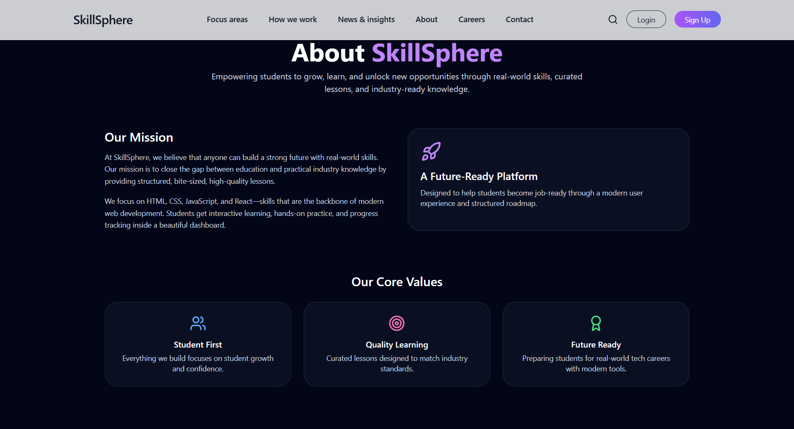
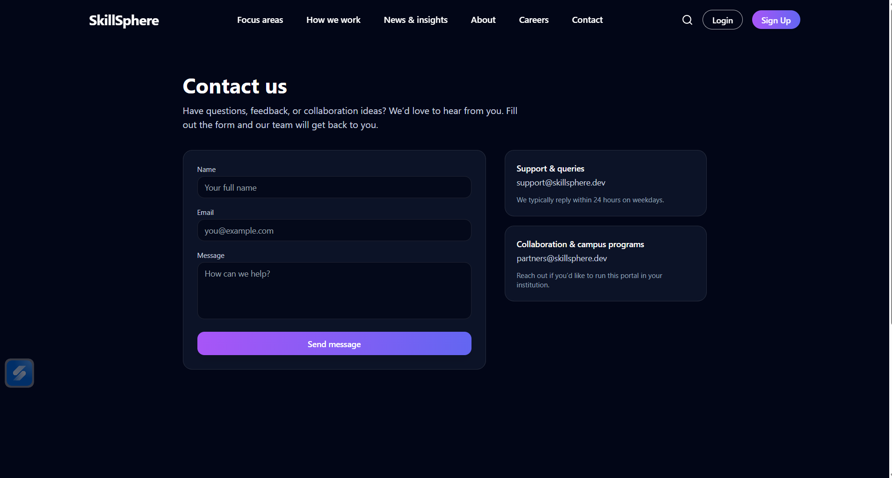
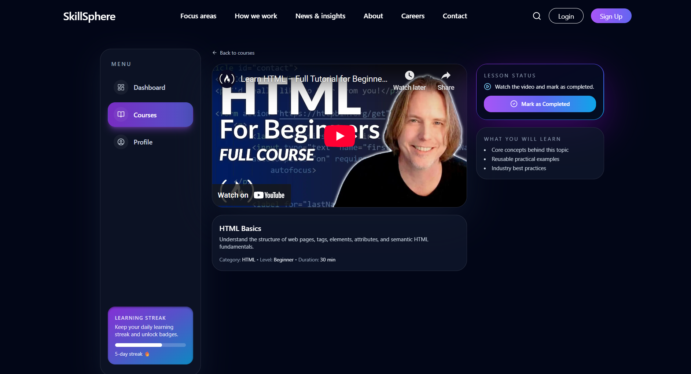
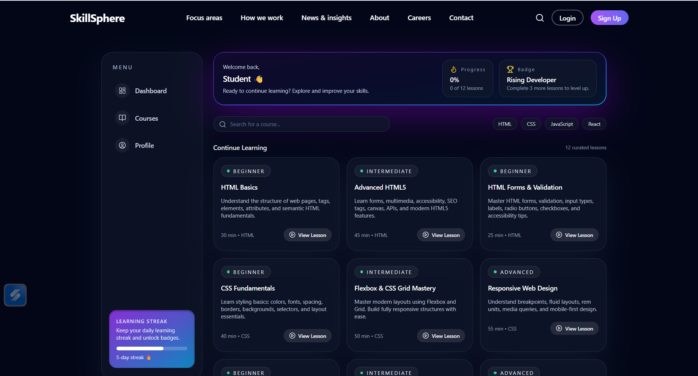
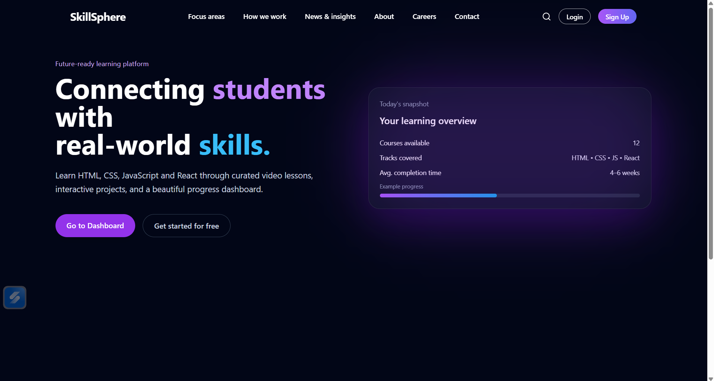
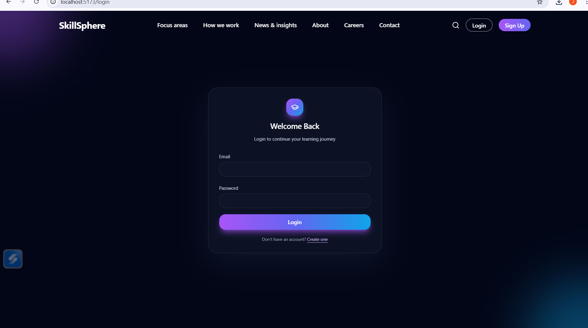
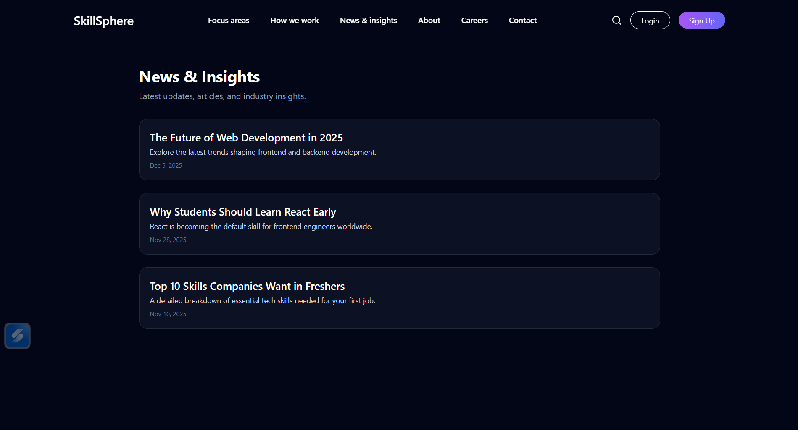
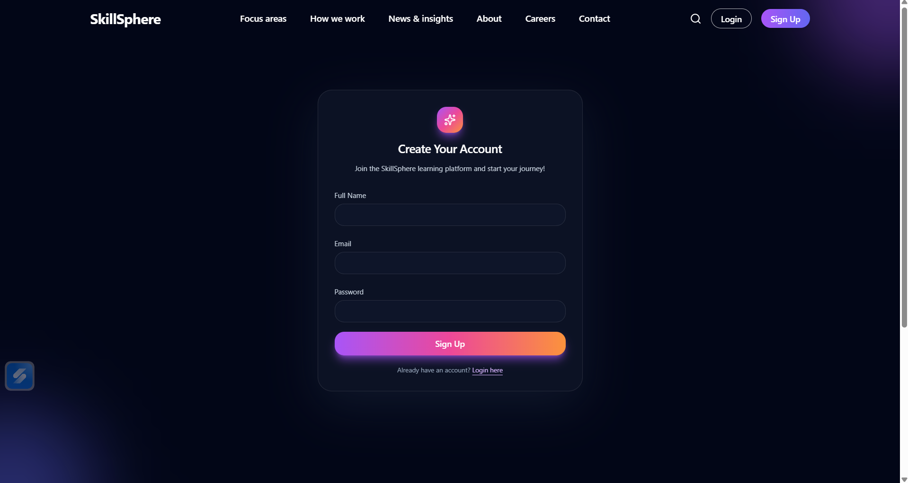
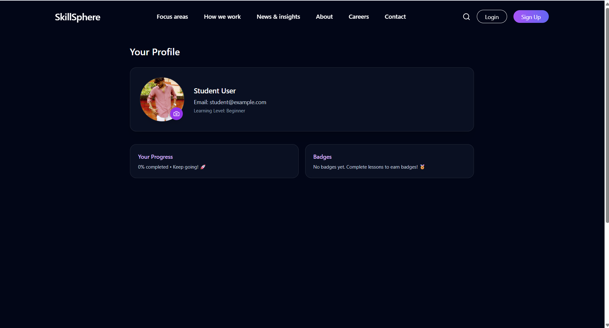

# 🎓 SkillSphere – Student Skill Learning Portal

A modern, responsive, and interactive learning platform designed for students to learn web development skills such as **HTML, CSS, JavaScript, and React** through structured lessons, videos, progress tracking, and a clean dashboard UI.

This project is built with **React + Tailwind CSS + Framer Motion** and includes multiple premium pages like Dashboard, Courses, Careers, About, Contact, and more.

---

## 🚀 Project Overview

SkillSphere is a learning portal created to help students gain real-world skills with:

- Curated video lessons
- Dashboard progress tracking
- User-friendly UI
- Course details & completion tracking
- Responsive design
- Professional landing pages

This project demonstrates **frontend skills**, UI design knowledge, routing, local storage auth logic, animations, and reusable component structure.

---

## ⭐ Features

### 📘 Core Learning System
- Interactive Dashboard  
- Courses grid (HTML, CSS, JS, React)  
- Video-based learning  
- Mark lessons as completed (LocalStorage)  
- Track progress  

### 🧭 Fully Designed Pages
- Homepage / Focus Areas  
- How We Work  
- About Page  
- Careers Page  
- Contact Page  
- News & Insights  
- Blog Detail Page  

### 🔐 Authentication
- Login  
- Signup  
- (Optional) Protected Routes  

### 🎨 UI & UX
- Premium dark mode design  
- Gradient effects  
- Animations using **Framer Motion**  
- Beautiful Navbar + Footer  

### ⚙️ Technical Features
- React Router  
- LocalStorage-based user system  
- JSON course data  
- Component-based architecture  

---

## 📂 Folder Structure

student-skill-portal/
│
├── public/
├── src/
│   ├── components/
│   │   ├── Navbar.jsx
│   │   ├── Footer.jsx
│   │   ├── Sidebar.jsx
│   │   ├── CourseCard.jsx
│   │   └── PrivateRoute.jsx
│   │
│   ├── pages/
│   │   ├── Homepage.jsx
│   │   ├── Dashboard.jsx
│   │   ├── Courses.jsx
│   │   ├── CourseDetail.jsx
│   │   ├── Login.jsx
│   │   ├── Signup.jsx
│   │   ├── About.jsx
│   │   ├── Careers.jsx
│   │   ├── Contact.jsx
│   │   ├── Focus.jsx
│   │   ├── Work.jsx
│   │   ├── News.jsx
│   │   └── BlogDetail.jsx
│   │
│   ├── data/
│   │   └── courses.json
│   │
│   ├── context/
│   │   └── AuthContext.jsx
│   │
│   ├── App.jsx
│   ├── main.jsx
│   └── index.css
│
├── package.json
└── README.md
## 📸 Screenshots

### 🏠 About Page

### 📞 Contact Page

### ▶️ Course Detail

### 📊 Dashboard

### 🏡 Home Page

### 📝 Login Page

### 📰 News Page

### ℹ️ Sign Up Page

## Profile page

---
